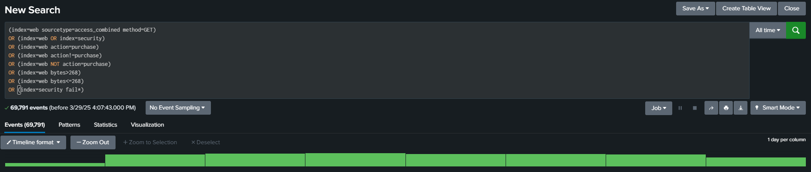
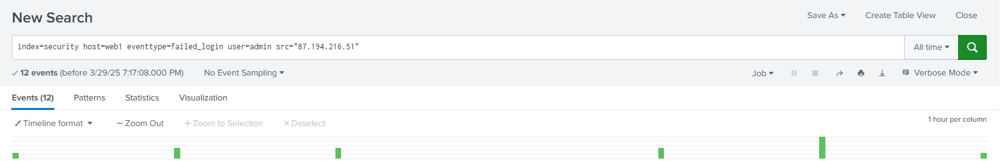
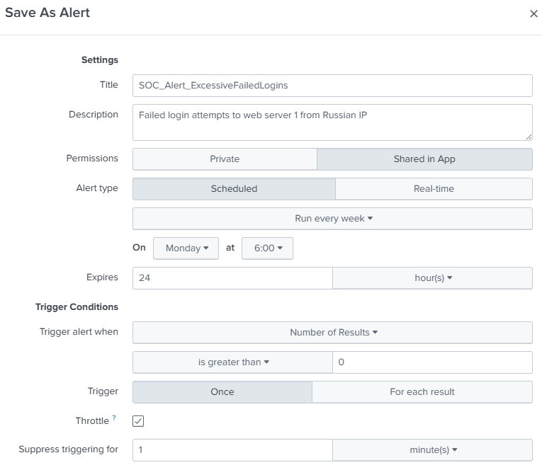
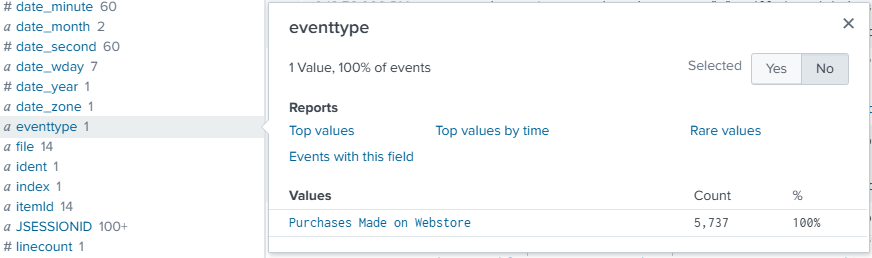

# How to Setup Splunk & Upload Testing Data  

## Access Splunk Web  
- Open your browser and go to `http://127.0.0.1:8000/`  
- Log in with your Splunk credentials  

## 1. Install Splunk Add-ons  
Install the following add-ons to ensure correct source typing and log parsing:  
- **Splunk Add-on for Cisco WSA** (for Cisco IronPort logs)  
- **Splunk Add-on for Unix and Linux** (for Linux authentication logs)  

**Steps:**  
1. Navigate to `Apps` → `Find More Apps`  
2. Search for and install the required add-ons via Splunkbase  

> ✅These add-ons enable automatic field extractions, making searches more efficient.  

## 2. Prepare Data  
Extract `zip` file from Splunk that contains:  
- **Web logs** (`access.log`, `secure.log`) for `www1`, `www2`, `www3`  
- **Cisco IronPort logs** (`cisco_ironport_web.log`)  
- **Additional data** (`MOCK_DATA.csv`, used later)  

> ✅These logs simulate real-world security events, providing a hands-on experience.  

## 3. Upload Data to Splunk  
Go to **`Settings` → `Add Data` → `Upload`**, then follow these steps:  

### Web Server Logs (`www1`, `www2`, `www3`)  
1. **Upload `access.log`**  
   - Source Type: `access_combined`  
   - Host: `web1` (or `web2`, `web3`)  
   - Index: `web`  

2. **Upload `secure.log`**  
   - Source Type: `linux_secure`  
   - Host: `web1` (or `web2`, `web3`)  
   - Index: `security`  

> ✅Correct source types ensure accurate parsing of Apache access logs and Linux authentication logs.  

### Cisco IronPort Log  
1. **Upload `cisco_ironport_web.log`**  
   - Source Type: `cisco:wsa:squid`  
   - Host: `cisco`  
   - Index: `cisco`  

> ✅Cisco WSA logs contain proxy traffic data, which is essential for network security monitoring.  

## 4. Validate Data in Splunk  
Use **Search & Reporting** to confirm ingestion:  
```splunk
index=* | stats count by index, sourcetype, source, host
```

  
*Setting up Splunk with testing data*  

# Adding Local Monitor Data to Splunk  

## 1. Add Local Event Logs  
- Navigate to **Settings** → **Add Data** → **Monitor**  
- Select **Local Event Logs** (Collect event logs from this machine)  
- Choose important logs to monitor:  
  - ✅ Application Logs  
  - ✅ Security Logs  
  - ✅ System Logs  
- Click **Next**, set **host value** to your machine  
- Create a new index (e.g., `application_system_security`)  
- Click **Review** → **Submit**  

## 2. Add Local Windows Host Monitoring  
- Go to **Add Data** → **Monitor**  
- Select **Local Windows Host Monitoring**  
- Enter a **Collection Name** (e.g., `my_local_logs`)  
- Select all available monitoring options  
- Set interval to **30 seconds**  
- Assign a new index (e.g., `my_computer_logs`)  
- Click **Save & Review** → **Submit**  

## 3. Search the Added Data  
- Use the **Search & Reporting** app  
- Query logs by their respective indexes:  
  ```spl
  index="applicatioin_system_security" or index="my_computer_logs"	

    source="my_local_logs" host="myHost" index="my_computer_logs" sourcetype="WinHostMon"
  ```

  
*Adding Monitoring of my Local Machine*  

  
* *  

  
* *  

  
* *  

  
* *  

  
* *  

  
* *  

  
* *  

  
* *  

  
* *  

  
* *  

  
* *  

  
* *  

  
* *  

  
* *  

  
* *  

  
* *  

  
* *  

  
* *  

  
* *  

  
* *  

  
* *  

  
* *  

  
* *  

  
* *  

  
* *  

  
* *  

  
* *  

  
* *  

  
* *  

  
* *  

  
* *  

  
* *  

  
* *  

  
* *  

  
* *  

  
* *  

  
* *  

  
* *  
