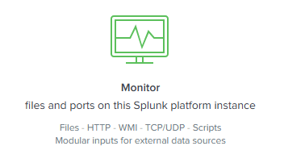
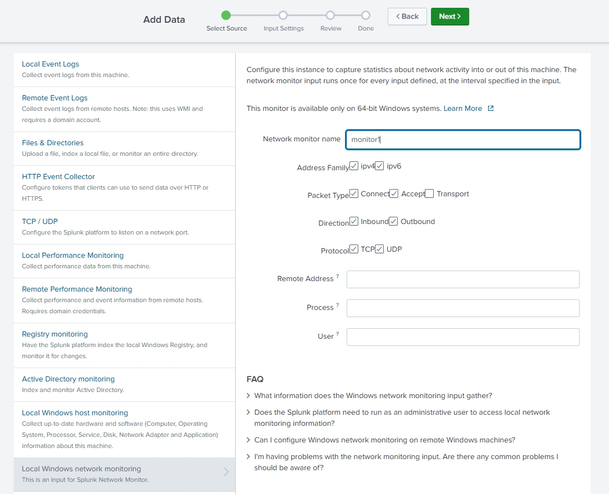
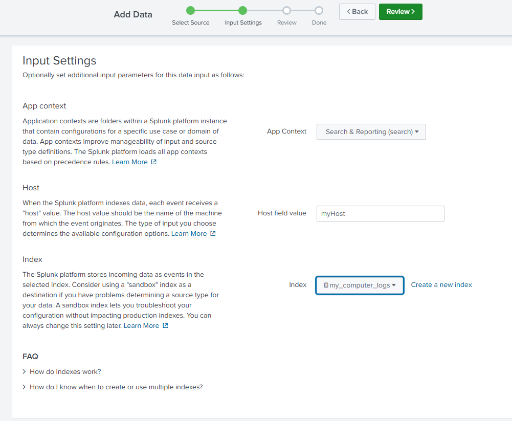
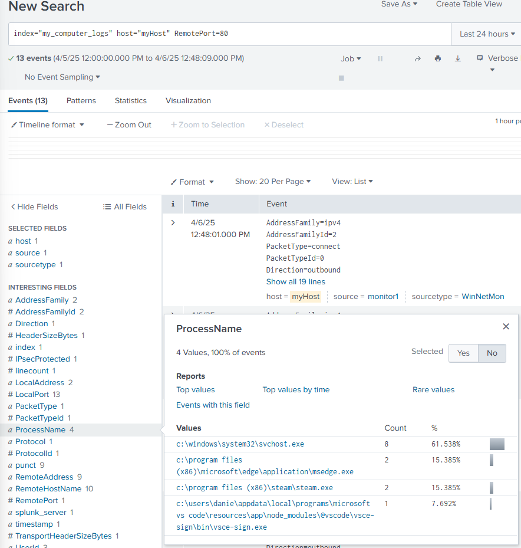
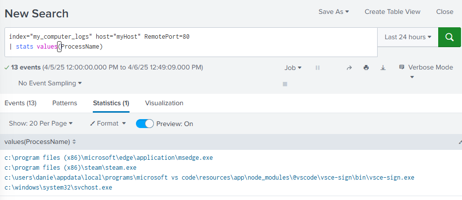
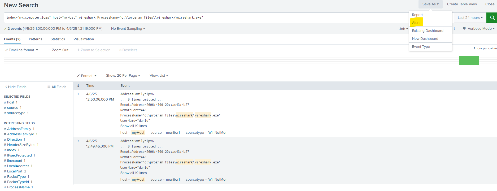
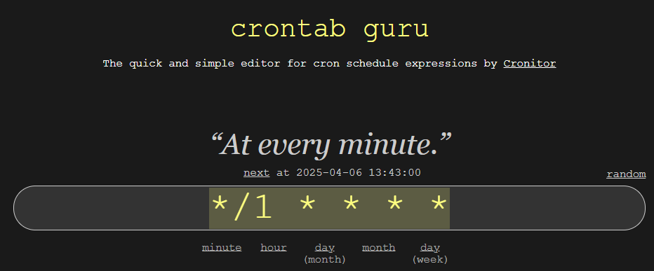
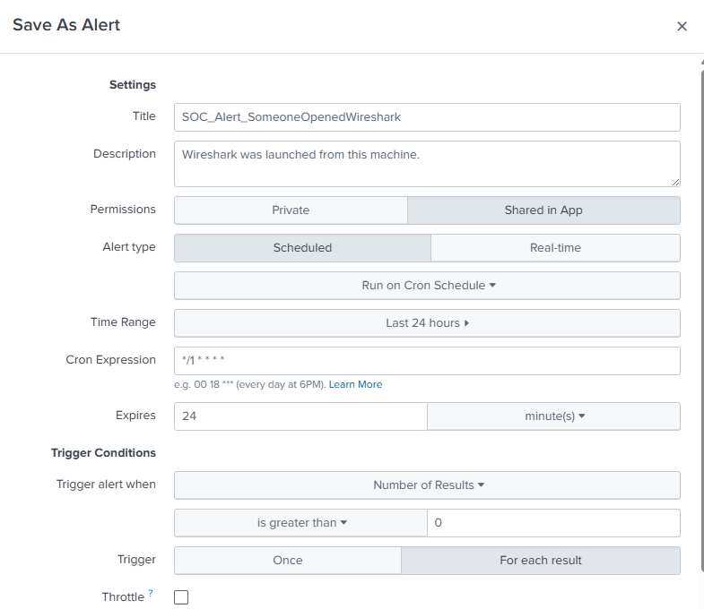
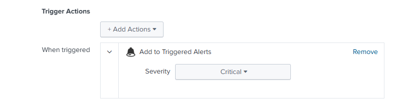
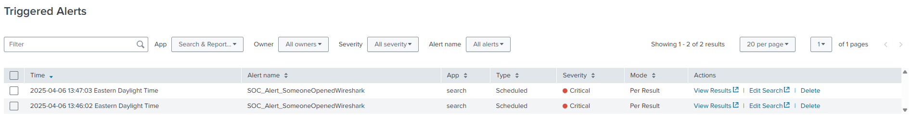

[Table of Contents](https://github.com/drajaram614/SPLUNK/blob/main/README.md)

# Understanding Splunk Alerts – Monitoring Your Local Machine

## 📥 1. **Setup: Monitor Local Logs**

### Step-by-step:

1. Go to `Settings` → `Data Inputs` → `Monitor`.



2. Select **Local Windows Network Monitoring**.
3. Collect data such as:
   - IP addresses
   - Packet types
   - Traffic direction (inbound/outbound)
   - Protocols (TCP/UDP)



4. Set the destination:
   - **Index**: Use a custom index like `mymachine_logs`
   - **Host**: Set to your machine's hostname
   - **Source**: Name it something like `Monitor1`



Let the data stream in for ~30 mins to gather enough events.
---

## 🔍 2. **Example Search Queries**

### View all outbound port 80 traffic:
```spl
index=mymachine_logs dest_port=80 direction=outbound
```



### See what processes were active:
```spl
index=mymachine_logs direction=outbound dest_port=80
| stats values(process_name)
```

---

## 🚨 3. **Create an Alert**

Let’s create an alert when **Wireshark** is launched.

### Example Search:
```spl
index=mymachine_logs process_name=wireshark.exe
```


### Save as Alert:
- **Title**: `SOC_Alert_SomeoneOpenedWireshark`
- **Description**: Wireshark was launched from this machine.
- **Permissions**: Share in app
- **Alert Type**: Scheduled
- **Cron Schedule**: Every 1 minute  
  ```
  * * * * *
  ```


- **Trigger Condition**:  
  - **Type**: Number of results > 0  
  - **Trigger For**: Each result
- **Alert Action**:  
  - Log alert in **Triggered Alerts**
  - Severity: **Critical**

 

---

## 📈 4. **View Triggered Alerts**

To view alerts:
- Go to `Activity` → `Triggered Alerts`
- You’ll see each time the alert was triggered when Wireshark was opened

Or:
- Go to `Settings` → `Searches, Reports, and Alerts`
- Run or edit alerts manually



---

## ✅ Example Use Case:

You open Wireshark →  
Splunk logs the event →  
Your alert detects it →  
It shows up in Triggered Alerts.

Repeatable, simple, and perfect for building foundational SOC monitoring skills.

---

Let me know if you'd like to add screenshots or turn this into a markdown file for GitHub.