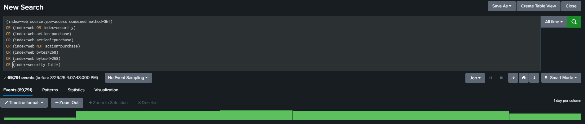
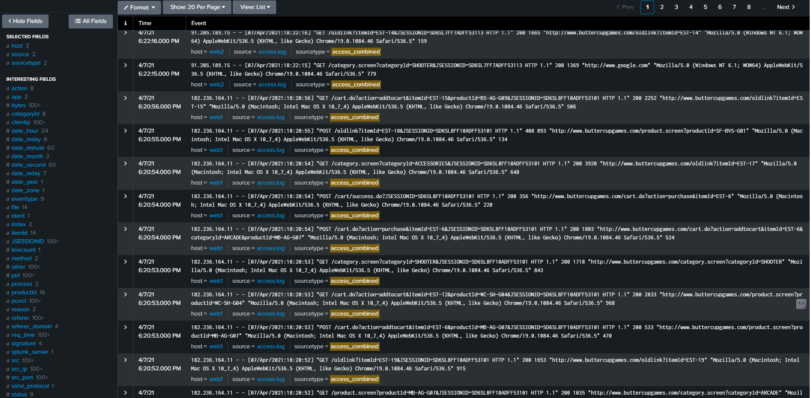

[Table of Contents](https://github.com/drajaram614/SPLUNK/blob/main/README.md)

# Understanding Searching Basics

## Time Picker
- Options: **Preset, Relative, Real-time, Custom date ranges**.
- Granular selection using time-stamping.

## Search Modes
- **Fast Mode**: Fewer fields, less data retrieved.
- **Verbose Mode**: More fields, complete data retrieval.
- **Smart Mode**: Auto-selects between Fast and Verbose.

## Running a Search
- Displays event timeline and total event count.
- **Job Inspector**: Analyze search performance.
- **Search Controls**: Pause, stop, export, and share searches.
- **Save As**: Convert searches into reports or alerts.

## Event Sampling & Timeline
- Event sampling reduces pulled data.
- Zoom in/out or highlight a section to refine searches.

## Field Menu
- Displays all fields and values in events.
- Expand events to view detailed fields.
- Add fields to searches directly.

## Searching for Specific Values
- Click and highlight a value → **Add to Search**.
- **Field-based search** (`field=value`) is more efficient than raw string search.

## Boolean Operators
- `OR`: Match multiple conditions (`index=web OR index=security`).
- `AND`: Implicit between multiple conditions.
- `NOT`: Exclude conditions (`NOT action=purchase`).

## Comparison Operators
- `=` (equals), `!=` (not equals)
- `<`, `>`, `<=`, `>=` (numeric comparisons)
- Example:
  - `bytes > 268` → Shows events with bytes greater than 268.
  - `bytes <= 268` → Includes 268 and lower.

## Boolean `NOT` vs `!=`
- `action != purchase` → Returns events where action is not purchase.
- `NOT action=purchase` → Returns all events where action does not exist or is not purchase.
- **Difference**: `NOT` expands the event scope significantly.

## Basic Search Commands to Test
| Search Command | Explanation |
|---------------|------------|
| `index=web sourcetype=access_combined method=GET` | Searches for GET requests in the web index with the specified sourcetype. |
| `index=web OR index=security` | Searches events in either the `web` or `security` index. |
| `index=web action=purchase` | Searches for events in the `web` index where the `action` field is `purchase`. |
| `index=web action!=purchase` | Searches for events in the `web` index where the `action` field is **not** `purchase`. |
| `index=web NOT action=purchase` | Searches for events in the `web` index where the `action` field is missing or is **not** `purchase`. |
| `index=web bytes > 268` | Searches for events in the `web` index where the `bytes` field is greater than 268. |
| `index=web bytes<=268` | Searches for events in the `web` index where the `bytes` field is less than or equal to 268. |
| `index=security fail*` | Searches for events in the `security` index where a field contains any term that starts with "fail" (e.g., `failure`, `failed`). |

  
  

  
  