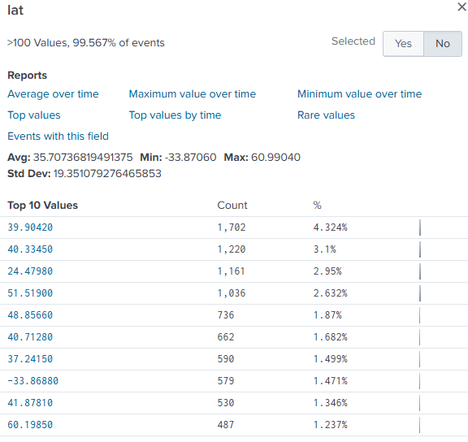

[Table of Contents](https://github.com/drajaram614/SPLUNK/blob/main/README.md)


# **Splunk Dashboards**
---
## **1. Total Events Over Time (Line Chart with Trendline)**
**Search:**  
```spl
index=_internal sourcetype=splunkd
| timechart count 
| trendline sma5(count) as "Our Moving Average of Total Events"
```
- **Displays the total number of events over the past three days as a line chart.**  
- **Includes a moving average trendline to smooth out fluctuations.**


---

## **2. Geolocation of Users (Cluster Map)**  
**Search:**  
```spl
| inputlookup peopleinfo.csv
| eval count=1
| geostats latfield=lat longfield=long globallimit=40 sum(count) by email
```

### **Explanation:**  
- `| inputlookup peopleinfo.csv` → Loads data from the `peopleinfo.csv` lookup file, which contains user details, including IP addresses, latitude, and longitude.  
- `| eval count=1` → Creates a new field called `count` and assigns a value of `1` for each record to be summed later.  
- `| geostats latfield=lat longfield=long globallimit=40 sum(count) by email`  
  - `latfield=lat longfield=long` → Specifies latitude (`lat`) and longitude (`long`) fields for mapping.  
  - `globallimit=40` → Limits the number of locations displayed on the map to 40 for better visualization.  
  - `sum(count)` → Aggregates the count of occurrences at each location.  
  - `by email` → Groups results by the `email` field to show the number of users per location.  

### **Result:**  
- **Displays user locations on a cluster map using latitude and longitude.**  
- **Aggregates the number of users per location, grouped by email addresses.**


---
## Geolocation with `iplocation` Command

In `index=web`, the correct field to use is `clientip`. 

```spl
index=web
| iplocation clientip
```

This will generate `lat` (latitude) and `lon` (longitude) fields for each IP address in the `clientip` field.

> **Note:** Any field containing an IP address can be used with the `iplocation` command to generate geolocation information.


  

---

## **3. Purchases by Region (Cluster Map)**
**Search:**  
```spl
index=web action=purchase
| iplocation clientip
| geostats count by action
```
- **Visualizes total purchases by region using a cluster map.**  
- **Hover over points to see the number of purchases per location.**

 

---

## **4. Total Sales by Region (Add Totals Example)**
**Search:**  
```spl
index=web action=purchase
| iplocation clientip
| geostats count by action
| addtotals row=f col=t label="Total Purchases" labelfield=longitude purchase
```
- **Adds a total row to sum all purchases across regions.**
- **Calculates the total number of purchases and displays it under the "Total Purchases" label.**
- **Uses the `addtotals` command to create a summary of purchases by region.**

 

---

## **5. High vs. Low Sales Regions (Dashboard Panels)**
**High Sales Panel:**  
```spl
index=web action=purchase
| iplocation clientip
| geostats count by action
| where purchase>500
```
- **Displays regions with more than 500 purchases.**

 

**Low Sales Panel:**  
```spl
index=web action=purchase
| iplocation clientip
| geostats count by action
| where purchase<100
```
- **Displays regions with fewer than 100 purchases.**

 

---

## **Dashboard Customizations**
- **Switch to dark mode for better contrast.**
- **Disable "Zoom on Scroll" in map visualizations to prevent accidental zooming.**
- **Arrange panels side by side for better comparison.**

 