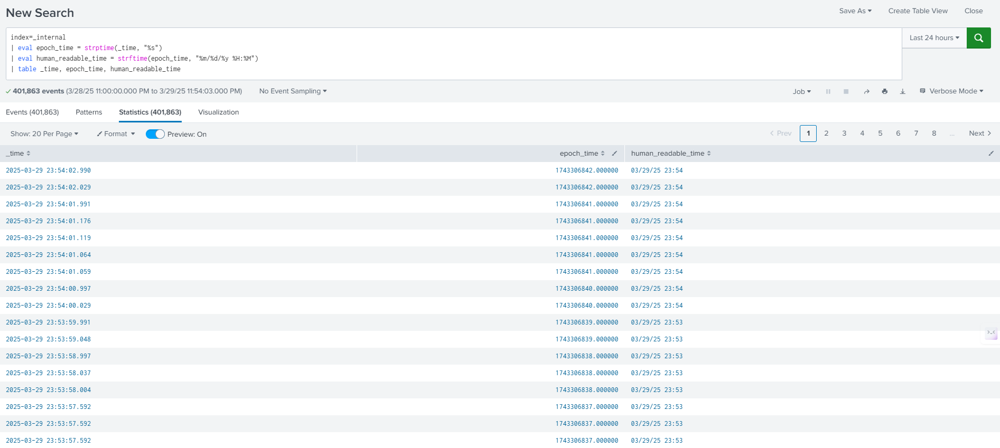
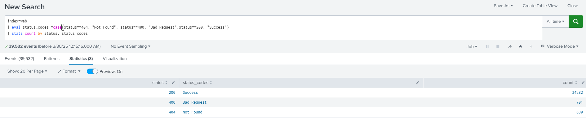
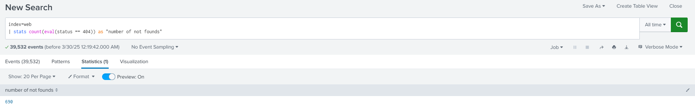
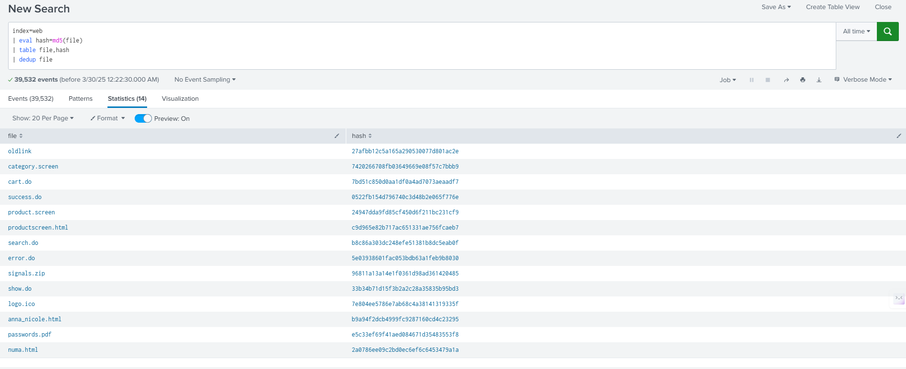
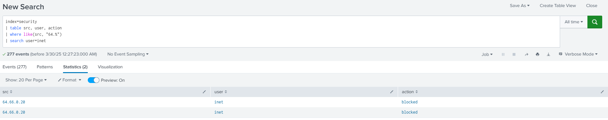

[Table of Contents](https://github.com/drajaram614/SPLUNK/blob/main/README.md)

# Understanding `eval`, `where`, and `search` in Splunk  

## **Understanding the Splunk Search Query**

```spl
index=_internal
| eval epoch_time = strptime(_time, "%s")
| eval human_readable_time = strftime(epoch_time, "%m/%d/%y %H:%M")
| table _time, epoch_time, human_readable_time
```

This search extracts internal Splunk logs and transforms the `_time` field into both **epoch time** and a **custom human-readable format**.

---

### **1. `index=_internal`**
- Retrieves data from Splunk’s internal index, which stores logs related to system operations, searches, and performance metrics.
- The `_time` field is automatically included in all indexed events and represents the timestamp when the event was logged.

---

### **2. `eval` Command**
The `eval` command is used to create or modify fields based on calculations and functions.

#### **Key Functions Used:**
##### **A. `strptime(_time, "%s")` – Convert `_time` to Epoch Time**
- `strptime()` is a **string-to-time** function.
- `_time` in Splunk is already stored as a **human-readable timestamp**, but we use `strptime()` to explicitly convert it into **epoch time (Unix timestamp, seconds since Jan 1, 1970).**
- **`"%s"`** is the format specifier for Unix timestamps in seconds.
  
##### **B. `strftime(epoch_time, "%m/%d/%y %H:%M")` – Convert Epoch Time to Custom Human-Readable Format**
- `strftime()` is a **time-to-string** function.
- Takes the `epoch_time` field and converts it into a formatted string.
- **Format Breakdown:**
  - `%m` → Month (01-12)
  - `%d` → Day (01-31)
  - `%y` → Year (last two digits)
  - `%H` → Hour (24-hour format, 00-23)
  - `%M` → Minutes (00-59)
  
---

### **3. `table _time, epoch_time, human_readable_time`**
- The `table` command organizes the output into a structured format.
- Displays three columns:
  1. `_time` → Original Splunk event timestamp.
  2. `epoch_time` → Unix timestamp version.
  3. `human_readable_time` → Reformatted human-readable timestamp.

---

### **Example Output:**
| _time                 | epoch_time  | human_readable_time |
|----------------------|------------|---------------------|
| 2025-03-29 15:30:45 | 1711719045  | 03/29/25 15:30     |
| 2025-03-29 15:45:10 | 1711719910  | 03/29/25 15:45     |

---

### **Key Takeaways**
✅ `eval` allows you to manipulate data dynamically.  
✅ `strptime()` converts **human-readable timestamps** into **epoch time**.  
✅ `strftime()` converts **epoch time** back into a **custom human-readable format**.  
✅ `table` presents data in a structured way for easy analysis.  



### **Extract Day of the Year**  
```spl
| eval DayOfTheYear=strftime(_time, "%j")
```
- The `strftime(_time, "%j")` function extracts the **day number of the year** from the `_time` field.  
- `%j` represents the **ordinal day of the year**, meaning:  
  - **001** for January 1st  
  - **032** for February 1st  
  - **365** for December 31st (or **366** in a leap year)  
- This is useful for **trend analysis**, **seasonal pattern detection**, and **time-based calculations** in Splunk.

---

### **Example Output**
| _time                | DayOfTheYear |
|----------------------|-------------|
| 2025-01-01 12:00:00 | 001         |
| 2025-06-15 08:30:00 | 166         |
| 2025-12-31 23:59:59 | 365         |


1. **Filter Data from `index=web`**  
   - Searches the `web` index, which contains logs related to web activity.  

2. **Assign Descriptions to HTTP Status Codes**  
   - The `eval` command creates a new field, `status_codes`, using the `case` function:  
     - If `status` is **404**, it's labeled **"Not Found"** (Page not found).  
     - If `status` is **400**, it's labeled **"Bad Request"** (Client error).  
     - If `status` is **200**, it's labeled **"Success"** (Request successful).  

3. **Count Occurrences of Each Status Code**  
   - `stats count by status, status_codes` calculates how many times each status code appears in the logs.  

#### **Example Output:**  

| status | status_codes  | count |  
|--------|--------------|-------|  
| 200    | Success      | 1500  |  
| 400    | Bad Request  | 300   |  
| 404    | Not Found    | 450   |  

This query helps analyze web traffic and identify common HTTP response statuses. 🚀

```spl
index=web  
| eval status_codes = case(status==404, "Not Found", status==400, "Bad Request", status==200, "Success")  
| stats count by status, status_codes  
```  


### **Understanding `eval` in `stats count`**  

```spl
index=web  
| stats count(eval(status == 404)) as "number of not founds"
```  

1. **Filter Data from `index=web`**  
   - Searches logs in the `web` index.  

2. **Use `eval` Inside `count()`**  
   - `eval(status == 404)` returns **`true` (1)** for rows where `status` is `404` and **`false` (0)** otherwise.  
   - `count(eval(status == 404))` **counts only the rows where `status == 404` is true**.  

3. **Rename the Counted Field**  
   - The result is labeled `"number of not founds"`, showing how many times `404` occurred.  

💡 **Key Takeaway:** `eval` inside `count()` filters what gets counted! 🚀




### **Generating MD5 Hash for Files and Removing Duplicates**  

```spl
index=web  
| eval hash=md5(file)  
| table file, hash  
| dedup file  
```  

1. **Generate MD5 Hash:**  
   ```spl
   | eval hash=md5(file)
   ```  
   - Creates a unique MD5 hash for each file name.  
   - Helps in verifying file integrity or detecting duplicates.  

2. **Display Only Relevant Fields:**  
   ```spl
   | table file, hash
   ```  
   - Shows only the `file` name and its corresponding `hash`.  

3. **Remove Duplicate Files:**  
   ```spl
   | dedup file
   ```  
   - Keeps only the first occurrence of each file, removing duplicates.  

💡 **Key Takeaway:** This search helps track unique files by generating hashes and eliminating duplicates! 🚀



---

### **Key Components to Understand:**  

1. **Search Within the `security` Index:**  
   ```spl
   index=security
   ```  
   - Retrieves logs from the `security` index, which contains security-related events.  

2. **Select Specific Fields to Display:**  
   ```spl
   | table src, user, action
   ```  
   - Limits the output to only show `src` (source IP), `user`, and `action`.  

3. **Filter Source IPs That Start With `64.`**  
   ```spl
   | where like(src, "64.%")
   ```  
   - Uses the `like` function to match any `src` value that starts with `64.` (e.g., `64.233.160.1`).  
   - `%` acts as a wildcard, meaning it can match anything after `64.`  

4. **Further Filter Results Where `user` is `inet`:**  
   ```spl
   | search user=inet
   ```  
   - Keeps only events where the `user` field has the exact value `inet`.  
   - The `search` command works as an additional filter after previous conditions.  

```spl
index=security  
| table src, user, action  
| where like(src, "64.%")  
| search user=inet  
```



---

## **2. `where` Command**  
The `where` command filters results based on conditional logic (Boolean expressions).  

### **Key Features:**  
- Works like SQL’s `WHERE` clause.  
- Uses logical comparisons (`=`, `>`, `<`, `!=`).  
- Supports wildcard matching with `like()`.  

### **Common Use Cases:**  
- **Filter by specific IP address:**  
  ```spl
  | where src="192.168.1.1"
  ```
  - Shows events where `src` is exactly `192.168.1.1`.  

- **Find all IPs starting with `64.`:**  
  ```spl
  | where like(src, "64.%")
  ```
  - Returns events where the source IP starts with `64.`.  

- **Find failed logins where response time is greater than 2 seconds:**  
  ```spl
  | where status=401 AND response_time>2
  ```
  - Filters for failed logins (`401`) that took over 2 seconds.  

---

## **3. `search` Command**  
The `search` command is used to filter and retrieve events based on field values or free-text search.  

### **Key Features:**  
- More flexible than `where`, supports field-based and free-text searches.  
- Can be used at the beginning or within a search query.  
- Supports logical operators (`AND`, `OR`, `NOT`).  

### **Common Use Cases:**  
- **Search for a specific term in logs:**  
  ```spl
  index=security "failed login"
  ```
  - Finds logs containing the phrase `"failed login"`.  

- **Filter by source IP:**  
  ```spl
  index=security src="192.168.1.1"
  ```
  - Retrieves logs where `src` is `192.168.1.1`.  

- **Combine multiple conditions:**  
  ```spl
  index=web status=404 OR status=500
  ```
  - Returns events where status is `404` or `500`.  

- **Exclude certain results using `NOT`:**  
  ```spl
  index=security NOT src="10.0.0.1"
  ```
  - Excludes logs from `10.0.0.1`.  

---

## **Key Differences Between `eval`, `where`, and `search`**  

| Command   | Purpose | Key Feature | Example |
|-----------|---------|-------------|---------|
| `eval`    | Create or modify fields | Works with functions, transforms data | `| eval new_field=field1 + field2` |
| `where`   | Filter based on conditions | Boolean logic (>, <, !=, like()) | `| where response_time > 2` |
| `search`  | Retrieve matching events | Field-based and free-text search | `index=security src="192.168.1.1"` |

---
