[Table of Contents](https://github.com/drajaram614/SPLUNK/blob/main/README.md)

# Field Extraction in Splunk

## **Methods for Field Extraction**

### **1. Field Extraction via GUI**

There are three ways to access the **Field Extractor** in Splunk:

1. **From Settings:**
   - Go to **Settings > Fields > Field Extractions** and click on **Field Extractor** to open the GUI.
   
2. **From the Fields Bar Menu:**
   - Navigate to your desired index (e.g., `Cisco`) and scroll down to the **Extract New Fields** section.
   
3. **From Event Actions:**
   - In an event, click the **Event Action Dropdown** and select **Extract Fields** to use the GUI.

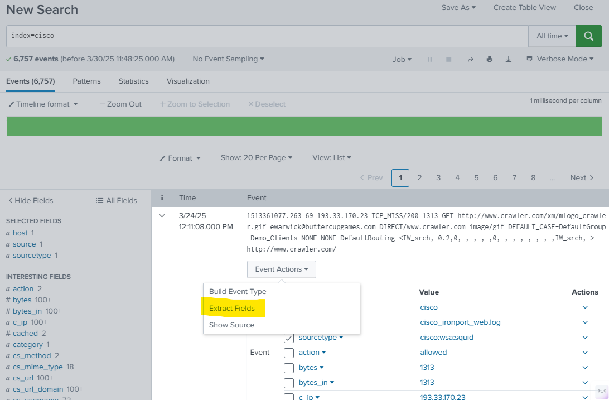

### **2. Using the Field Extractor GUI**

- **Delimiter Extraction:**
   - You can extract fields based on delimiters like spaces, commas, tabs, pipes, etc.

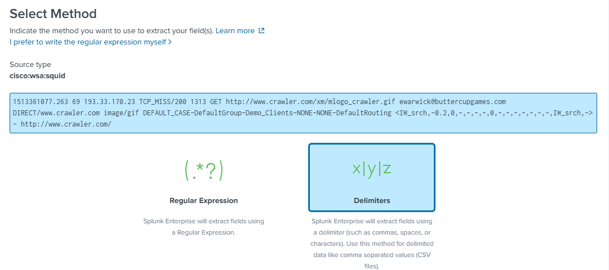 

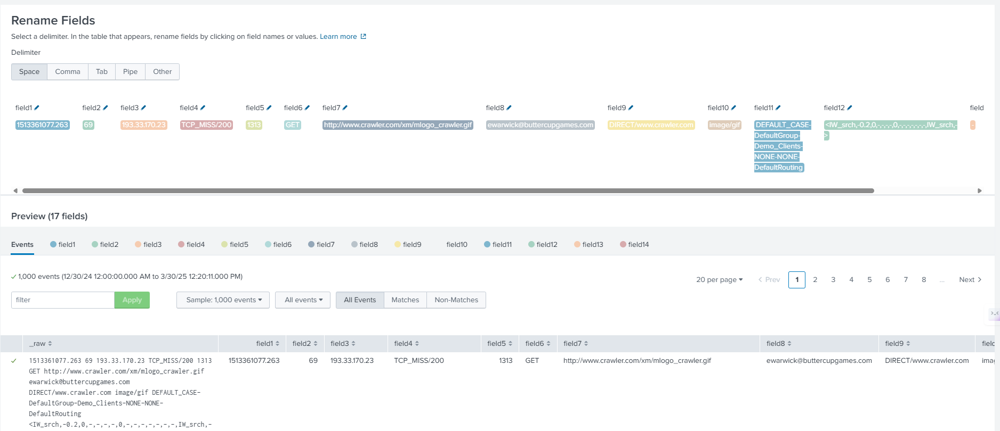     

- **Regular Expression Extraction:**
   - Highlight the field (e.g., IP Address) you want to extract and click **Add Extraction**.
   - Splunk automatically suggests regular expressions for these fields.

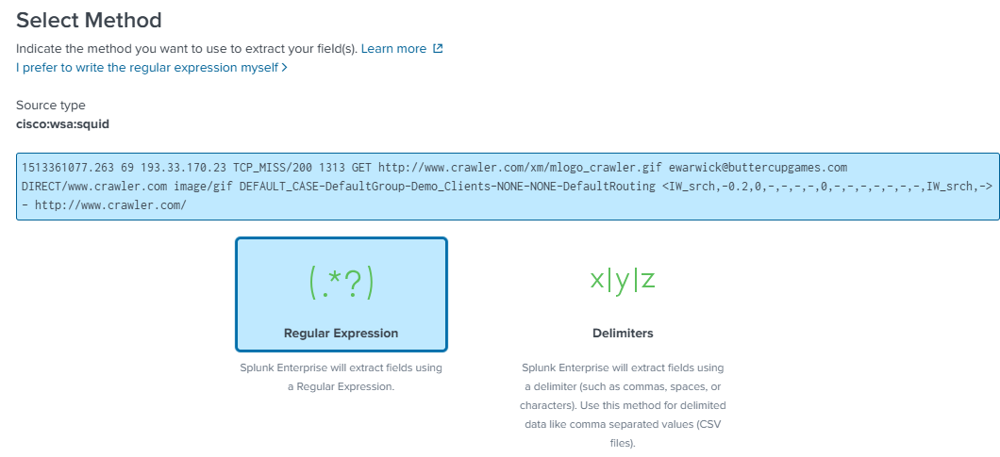    

#### Example Extractions:
- **IP Address**
- **Method** (e.g., GET, POST)
- **Domain or URL**

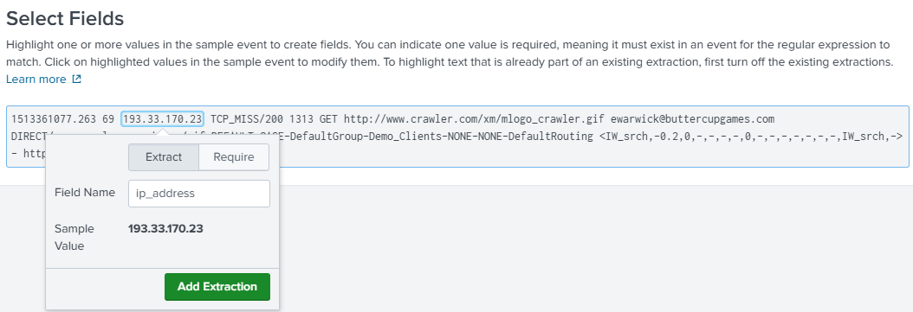  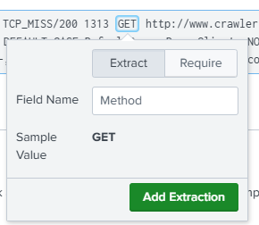  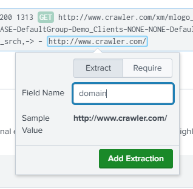  

You can preview the extracted fields before finalizing. 

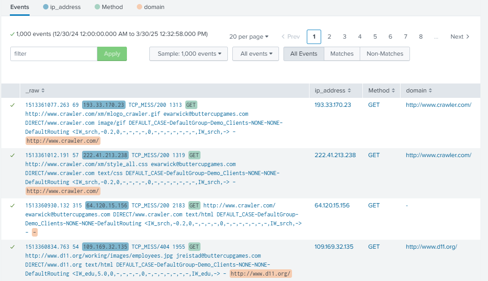  

Once finished, the fields will be available in your **Field Menu**.

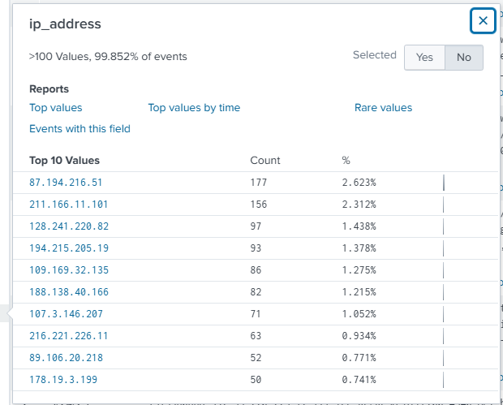  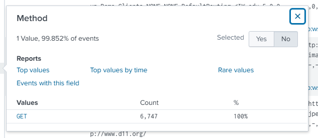  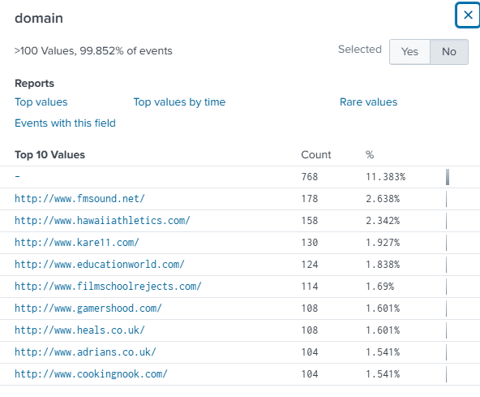   


### **3. Using `rex` Command**

- **Basic Syntax for `rex`:**
  ```spl
  rex field=<field_name> "<regular_expression>"
  ```

#### Example:
Extract an **Email Address** from raw logs using a regular expression:
1. Go to [regex101.com](https://regex101.com/) to test your regex.
2. Copy the regex (e.g., `\S+@\S+\.\S+`).
3. In Splunk:
```spl
index=cisco
| rex field=_raw (?<email>"\S+@\S+.com")
```

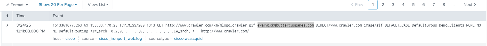  

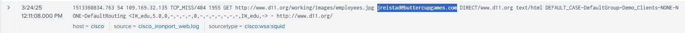  

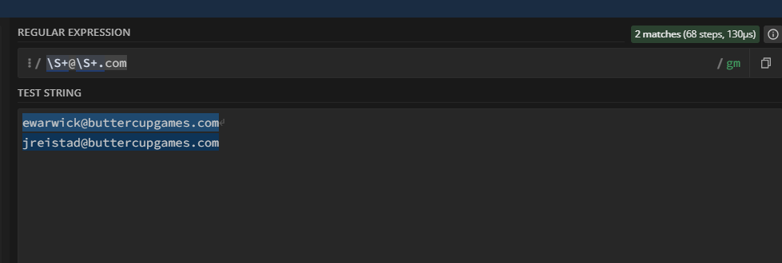  
*regex101.com*

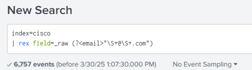 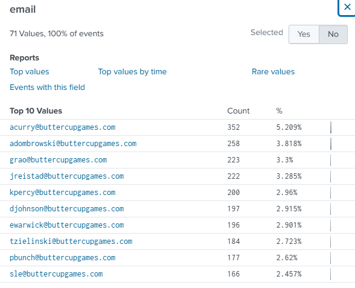

- **Result:** A new field `email` is created using regex.

### **4. Using `erex` Command**

The `erex` command is used for extracting fields based on **examples**. It needs sample values to generate the regular expression automatically.

#### Example:
1. From raw events, select examples like `image/gif` and `text/css`.
2. Use the following syntax:
   ```spl
   index=cisco
   | erex files examples="text/css", "image/gif"
   ```
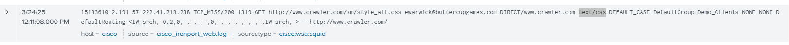
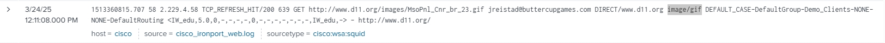
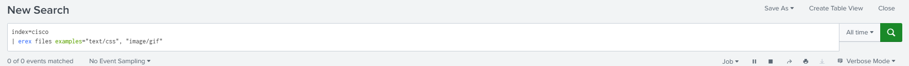

- **Result:** A new field `files` is created based on the examples provided.

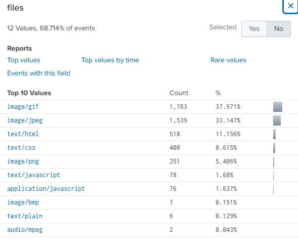

## **Summary of Field Extraction**

- **GUI Extraction**: Easier for users without regex knowledge. You can use delimiters or regular expressions to extract fields.
- **`rex` Command**: Useful for extracting fields using regular expressions on raw data.
- **`erex` Command**: Automatically generates a regular expression based on provided examples, helpful for extracting fields when you don’t know the exact pattern beforehand.

### **Example Searches:**

1. **Extracting an Email Address**:
   ```spl
   index=web
   | rex field=_raw "(?P<email>\S+@\S+\.\S+)"
   ```

2. **Extracting File Types**:
   ```spl
   index=web
   | erex field=_raw "files" "image/gif", "text/css"
   ```

---
