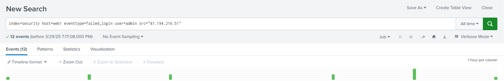
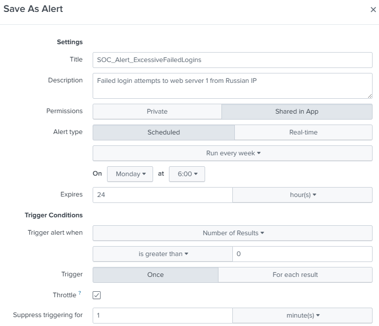
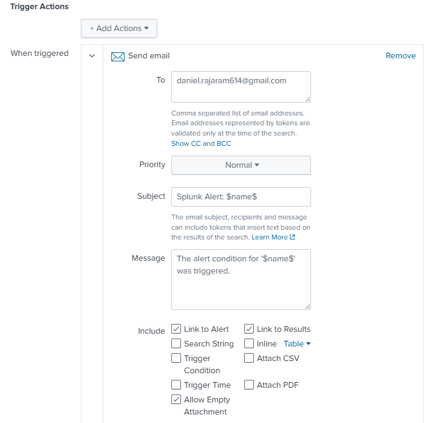
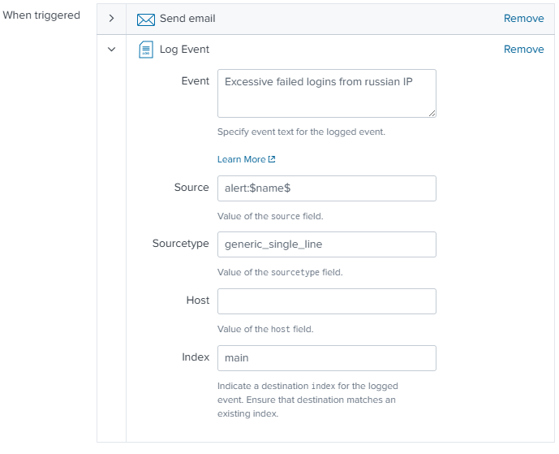
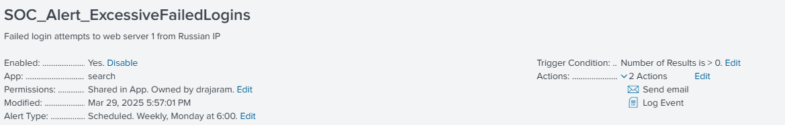
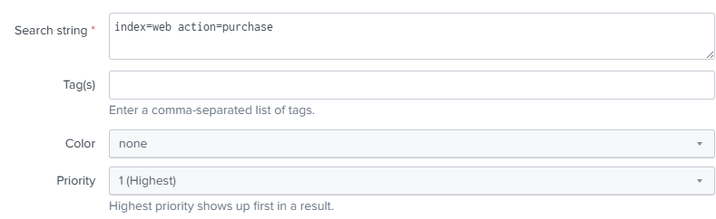
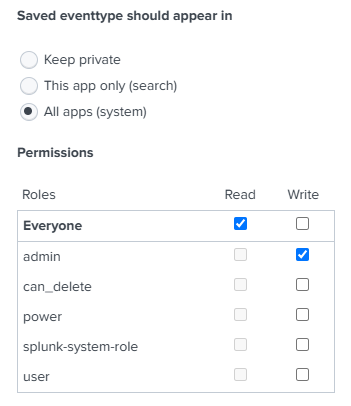
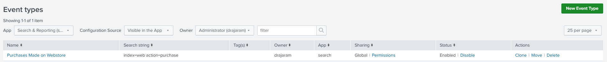
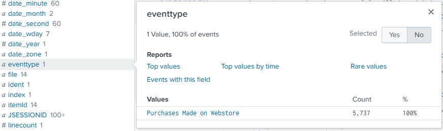

[Table of Contents](https://github.com/drajaram614/SPLUNK/blob/main/README.md)

# Understanding Knowledge Objects in Splunk

## What Are Knowledge Objects?
- Customizable elements in Splunk that enhance search, reporting, and alerting.
- Examples include alerts, event types, reports, field extractions, tags, and lookups.

## Creating an Alert (Knowledge Object)
- Navigate to **Settings > Knowledge** and select **Alerts**.
- Create a new alert by searching for **failed login attempts**.
- Apply filters:  
  - **Index:** security  
  - **Event Type:** failed login  
  - **User:** admin  
  - **Source:** Malicious IP address  
- Save the alert with a descriptive name following best practices:  
  - Example: `SOC_Alert_ExcessiveFailedLogins`
- Set **permissions**:  
  - Shared in App (so others can access it)
  - Read for everyone, Write for admin only
- Configure alert type and trigger conditions:  
  - **Scheduled** or **Real-time**
  - **Trigger when results > 0**
  - **Throttling** to limit notifications (e.g., once per minute)
- Add trigger actions:  
  - **Log the event**
  - **Send email notification**
- Save and review the alert under **Settings > Alerts**.

```spl
index=security host=web1 eventtype=failed_login user=admin src="87.194.216.51"
```


  

  

  

  

  

## Setting Permissions for Knowledge Objects
- Knowledge objects have owners and app associations.
- Permissions can be set to:
  - **Private** (only you can see it)
  - **Shared in App** (visible to users within a specific app)
  - **Global** (accessible across all Splunk apps)
- Recommended setting:  
  - **Read for all users, Write for admin only**.

## Creating an Event Type (Knowledge Object)
- Navigate to **Settings > Knowledge > Event Types**.
- Create a new event type with a recognizable search:
  - Example: `index=web action=purchase`
- Assign a name and optional **tags**.
- Set **permissions** for broader access.
- Run the search and verify the event type field.

  

  

## Managing Knowledge Objects
- View and edit knowledge objects under **Settings > Knowledge**.
- Modify permissions as needed.
- Advanced edit options allow further customization.
- Ensure proper **permissions and visibility** for collaborative environments.

  

  

  

  


