[Table of Contents](https://github.com/drajaram614/SPLUNK/blob/main/README.md)

# Understanding Lookups in Splunk

## What Are Lookups?  
Lookups in Splunk allow you to enrich your search results with additional data from external files (CSV, KV Store, etc.). This helps in providing meaningful labels or descriptions to existing fields.  

---

## 1. **Uploading a Lookup Table File**  
- Navigate to **Settings** → **Lookups** → **Lookup Table Files** → **New Lookup Table File**.  
- Upload a **CSV file** containing data you want to use as a lookup.  
- Example CSV (`peopleinfo.csv`) contains:  
  ```
  ID,First Name,Last Name,Email,IP,State,Latitude,Longitude
  1,John,Doe,johndoe@example.com,192.168.1.1,NY,40.7128,-74.0060
  ```
- Name it: `peopleinfo.csv`.  
- Save and **set permissions** (Search App, Read/Write for admin).  

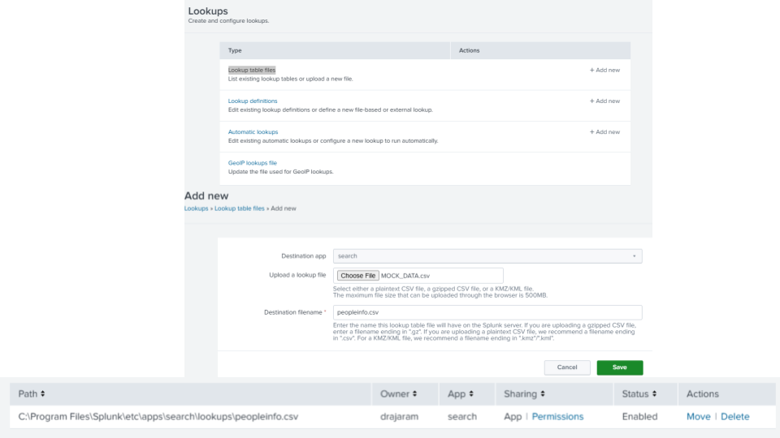

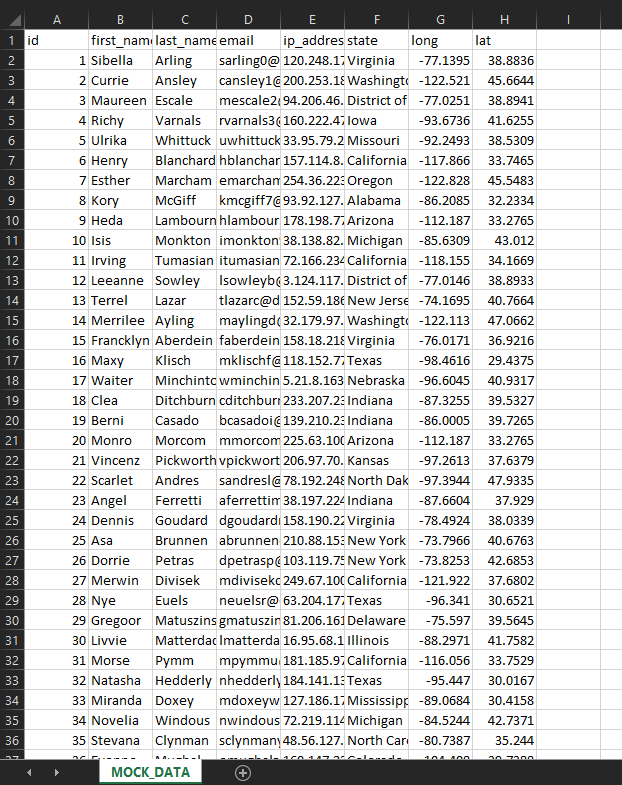
*MOCK_DATA file*
---

## 2. **Viewing Lookup Data in Splunk**  
Use the `inputlookup` command to see the lookup contents:  
```splunk
| inputlookup peopleinfo.csv
```
Filters can be applied using `where`:  
```splunk
| inputlookup peopleinfo.csv | where First_Name="Henry"
```
```splunk
| inputlookup peopleinfo.csv | where State="New York"
```

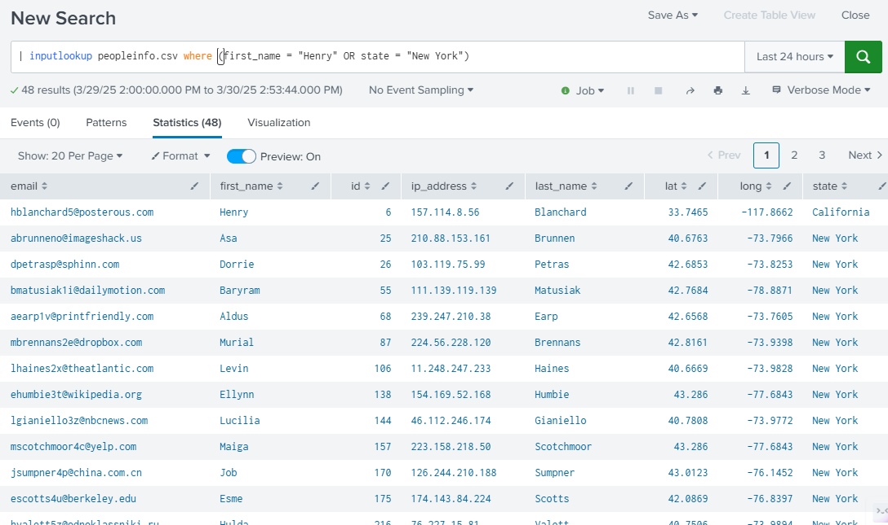

---

## 3. **Defining a Lookup**  
- Go to **Lookup Definitions** → **New Lookup Definition**.  
- Select the lookup file (`peopleinfo.csv`).  
- Keep it **File-based** (unless using KV Store).  
- Save and set **permissions**.  

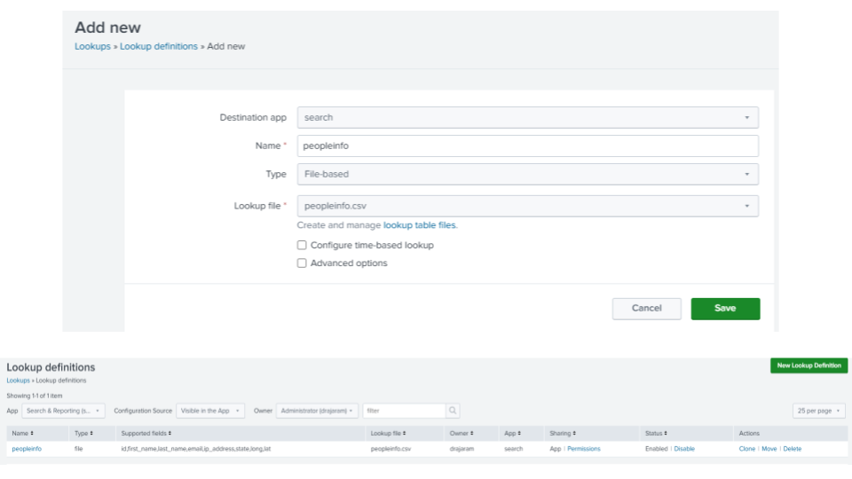

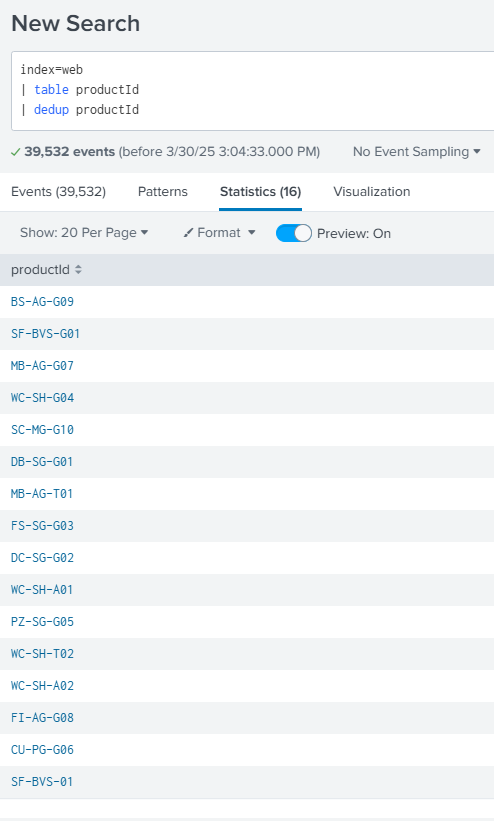
---

## 4. **Using Lookups in Searches**  
Example: Enriching Product Data  

1. **Create a Lookup for Product Information**  
   - Extract `product ID` values from a search:  
     ```splunk
     index=web | stats count by product_ID
     ```
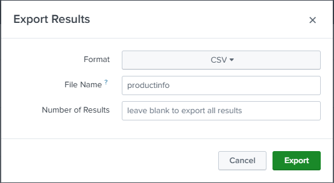
     
   - Export this as CSV (`productinfo.csv`) and add descriptions:  
     ```
     product_ID,description
     1001,Golf Balls
     1002,Running Shoes
     1003,Basketball
     ```
   - Upload and define this lookup as `productinfo.csv`.

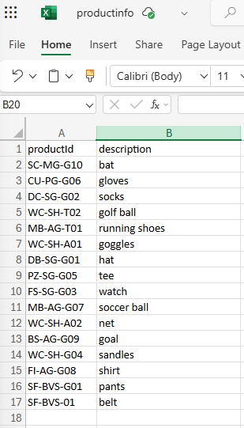

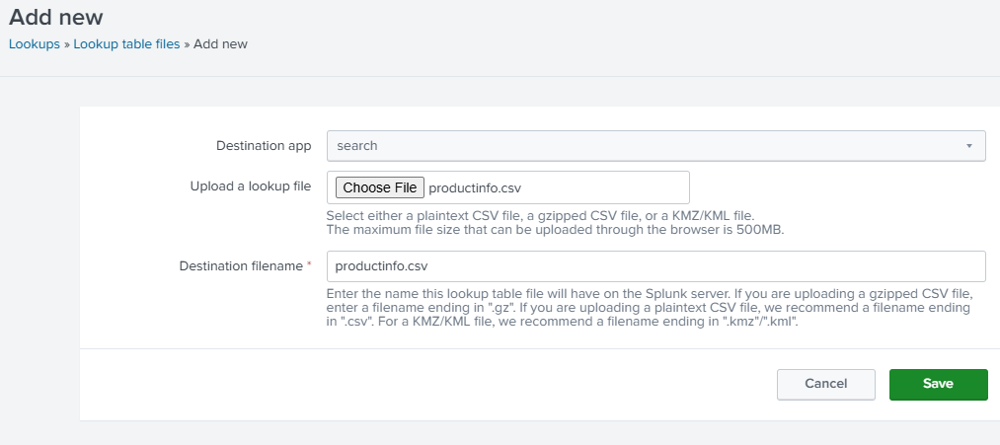  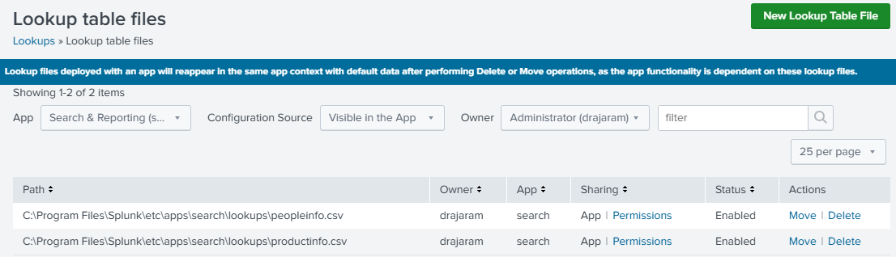

### 2. **Using the Lookup in a Search**  
```spl
index=web action=purchase
| lookup productinfo.csv productId OUTPUT description
| table productId description
| where isnotnull(productId)
```
   - **Enhances search results by replacing product IDs with meaningful product descriptions from the lookup table.**  

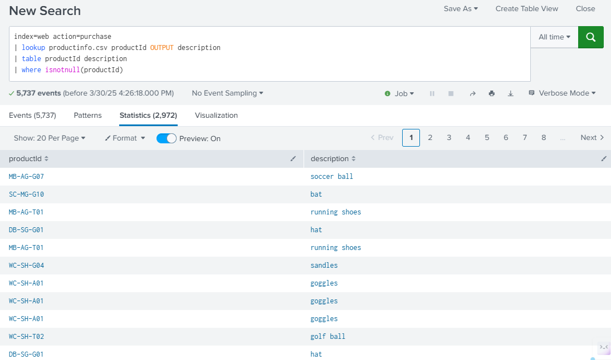  

---

### 3. **Analyzing Sales Data**  
```spl
index=web action="purchase"
| lookup productinfo.csv productId OUTPUT description
| stats count by productId description
| where isnotnull(productId)
| sort -count
```
   - **Aggregates and ranks products by sales count, showing which items were purchased most frequently.**  

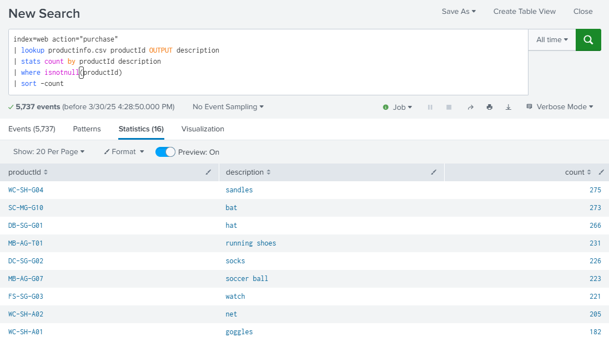
---

## Summary  
- **Lookups** help enrich Splunk search results.  
- **Upload CSV files** to use as lookup tables.  
- **Define lookups** to enable easy field matching.  
- **Use `inputlookup`** to view raw lookup data.  
- **Use `lookup`** to enhance search results with additional information.  