[Table of Contents](https://github.com/drajaram614/SPLUNK/blob/main/README.md)

# Reports and Drilldowns in Splunk

This guide demonstrates how to create **Reports** and use **Drilldowns** in Splunk, along with implementing **tokens** for interactive functionality in dashboards.

### 1. **Get Data to Work With**
We start by querying data for the past week, looking for specific fields like `log_level`, which contains values like INFO, WARN, and ERROR.

**Search Example:**
```spl
index=_internal log_level=*
| eval Date=strftime(_time, "%m/%d/%Y")
| where isnotnull(reason)
| table log_level, reason, Date
| dedup reason
| sort Date
```

- **Explanation:**
    - `strftime` formats `_time` to a "Month/Day/Year" format.
    - We filter logs where `reason` is not null.
    - Sorting logs by `Date` and displaying them in the table.

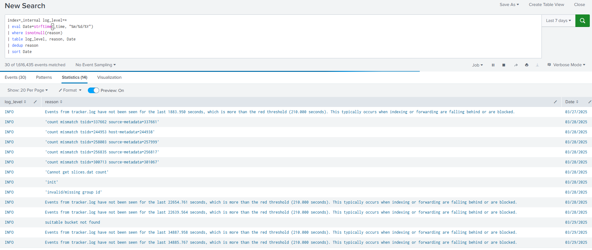  

**Dashboard:**
- Save this search as a **Dashboard Panel** to monitor log-level messages over the past week.

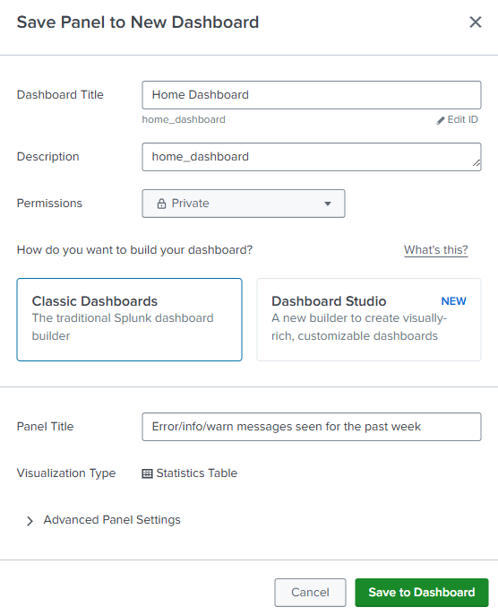  

---
### 2. **Add Input for Dynamic Search**
Now, let’s add an input that allows users to dynamically filter by log level (INFO, WARN, ERROR).

1. **Add Text Input:**
   - Set the token name to `loglevel`.
   - Enable the "Search on Change" option.

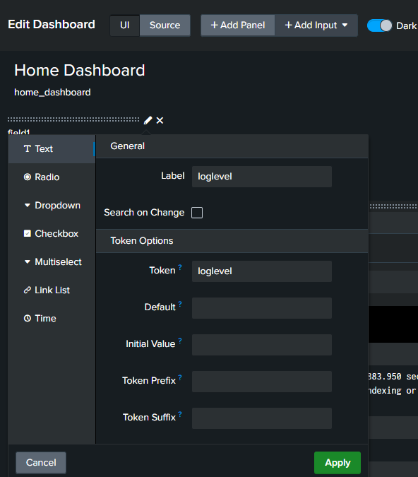  

2. **Edit Search with Token:**
   Modify the search to use the token:
   ```spl
   index=internal log_level=$loglevel$
   ```
   This will update the results based on the user's input.

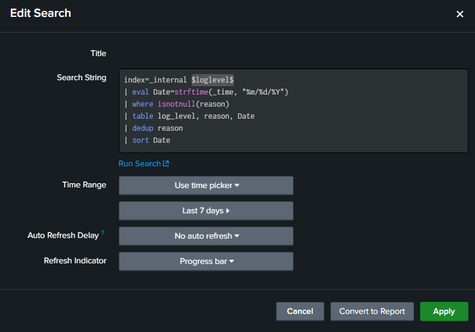  

**Dashboard Interactivity:**
- Once the input is submitted, the panel will filter results based on the user-defined log level (e.g., INFO).

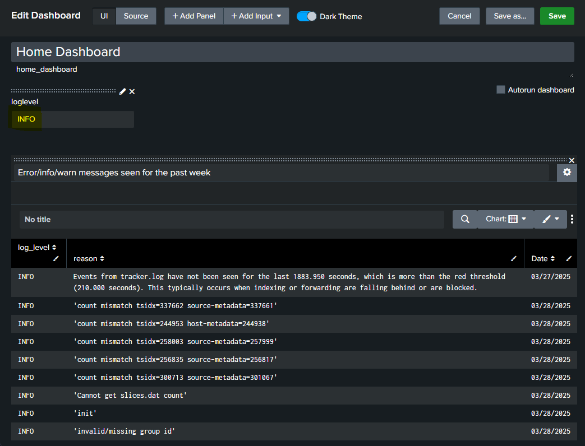  

### 3. **Add Time Picker**
Let’s also allow the user to choose a time range for the data.

1. **Add Time Picker Input:**
   - Set the token name to `time` and default to "Last 7 days".

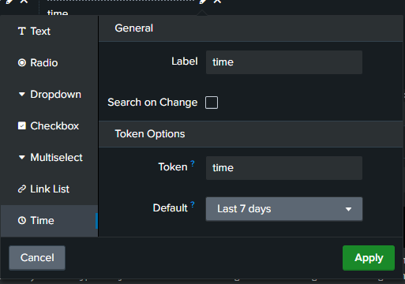  


2. **Edit Search with Token:**
   Modify the search to use the time picker token:
   ```spl
   index=internal log_level=$loglevel$ earliest=$time.earliest$ latest=$time.latest$
   ```
   This will use the user's selected time range.

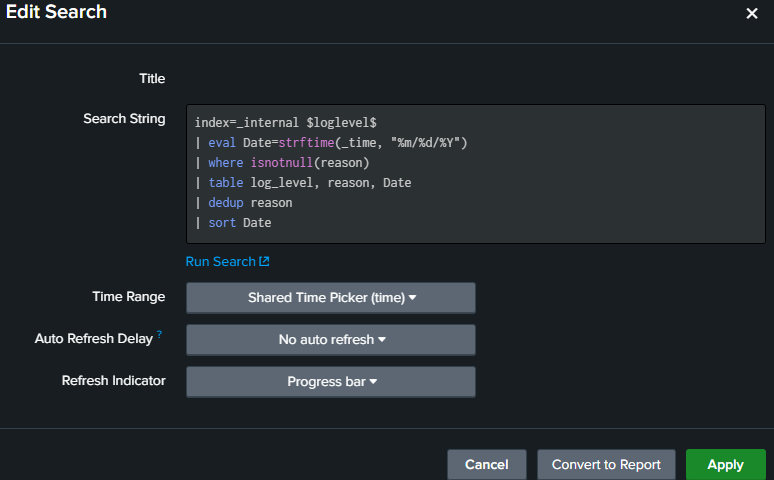  

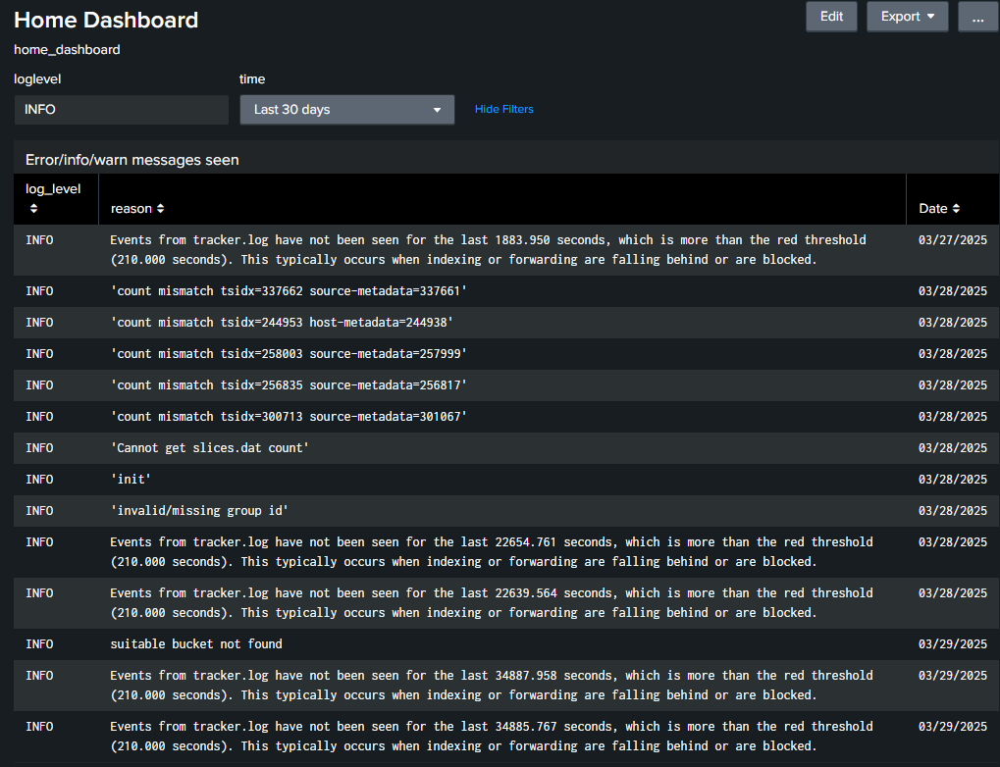  
*Did search for 30 days*

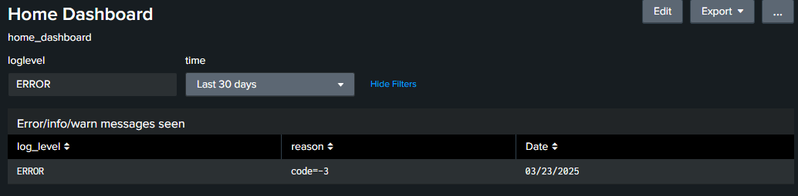  
*For seeing errors*

### 4. **Create Reports**  
Now, let's create a **Report** to track all `.exe` files observed across the environment.  

```spl
index=* "*.exe" host=myHost
```
- **`index=*`** → Searches across all available indexes.  
- **`"*.exe"`** → Looks for any event containing `.exe` files, indicating executable activity.  
- **`host=myHost`** → Filters results to only include logs from my own local machine(`myHost`).  

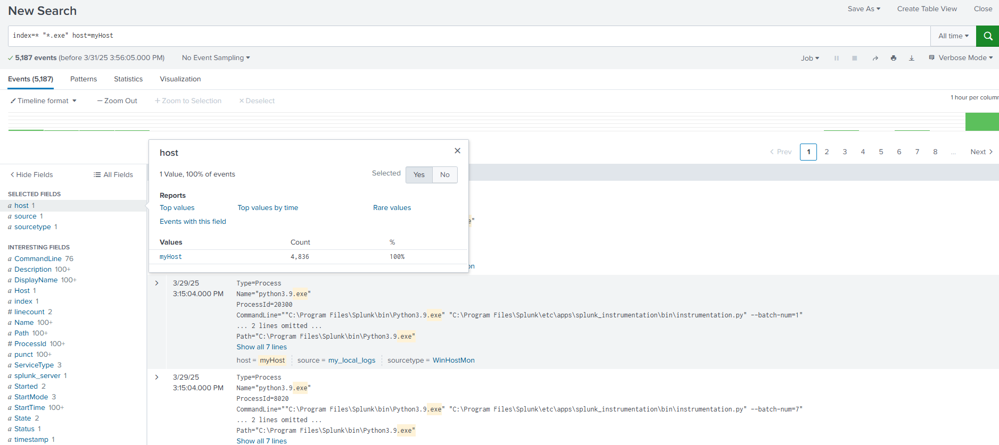 
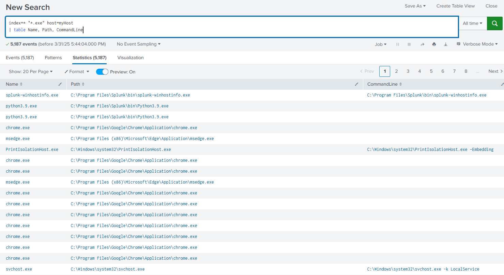 
**Save as Report:**
- Save this search as a **Report** (e.g., `SOC_Report_ExecutablesSeen`).

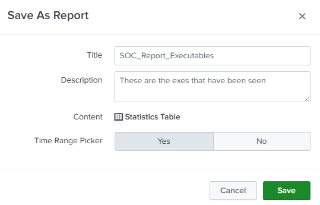 

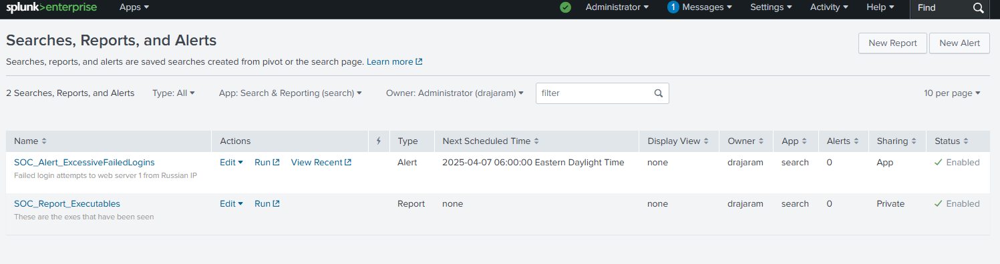

### 5. **Add Report to Dashboard**
Once the report is saved, add it to the **Home Dashboard**.

1. Go to the Dashboard and add a new panel with the report.
2. Title the panel as "Executables".

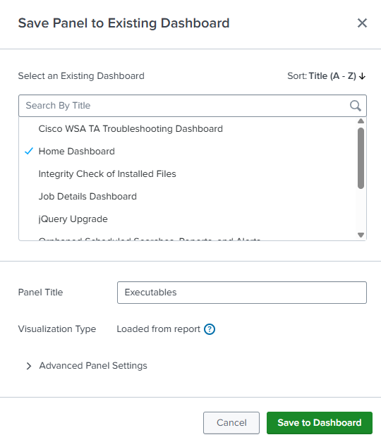

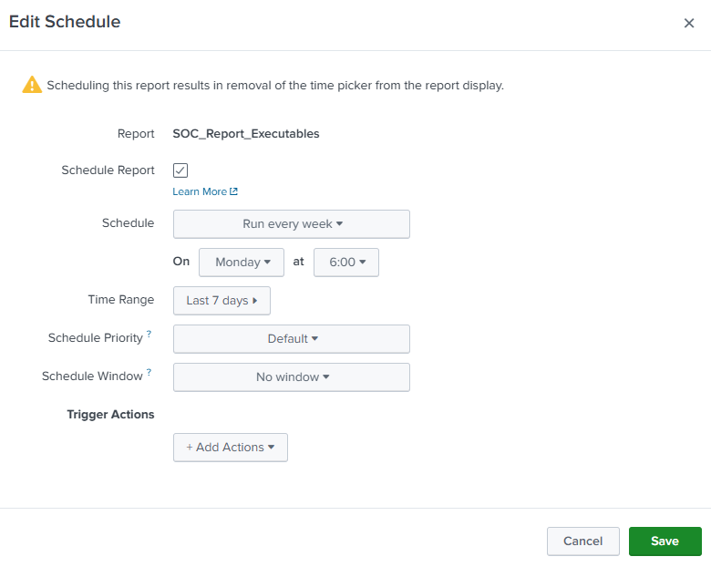
*Adding Schedule for the SOC report*

### 6. **Enable Drilldowns**
Drilldowns allow users to click on a value (e.g., an executable name) and view more details.

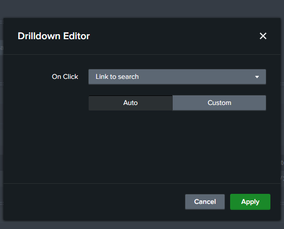

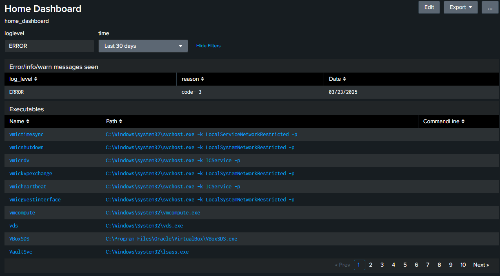
*Executables in dashboard become clickable*

**Enable Drilldown:**
1. Edit the panel and go to **Edit Drilldown**.
2. Choose "Link to Search" and define the token that will carry the clicked value.
   ```spl
   | search filename="$click_value$"
   ```

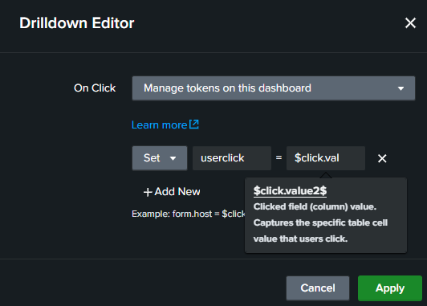
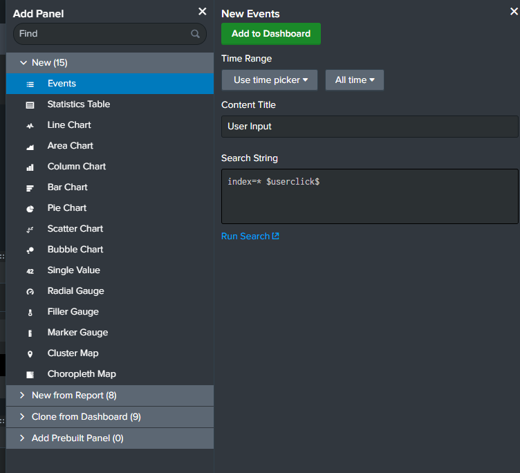

Now, when users click on an executable name, they’ll be directed to a search with more details.

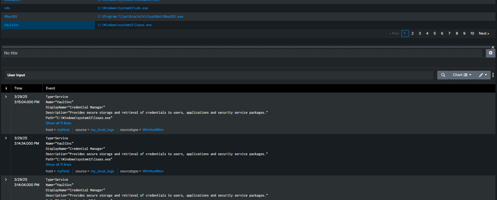

### 7. **Set the Dashboard as Home**
To make this dashboard your main dashboard:

1. Go to **Dashboards**.
2. Click **Edit** and select **Set as Home Dashboard**.

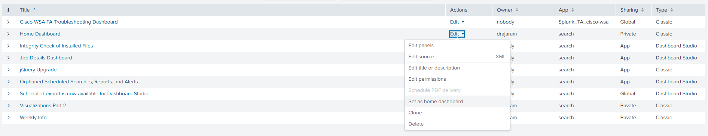

Now, this dashboard will load by default when you log in to Splunk.

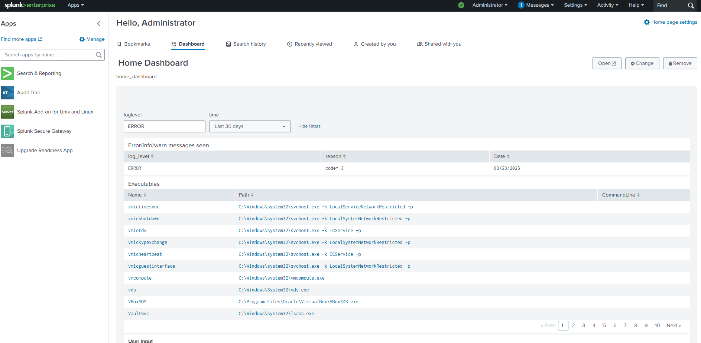

---

### Summary
- **Reports** provide a way to save specific searches and view results later.
- **Drilldowns** make dashboards interactive by allowing users to click on items and view related data.
- **Tokens** allow user input to dynamically filter and adjust searches in dashboards.
