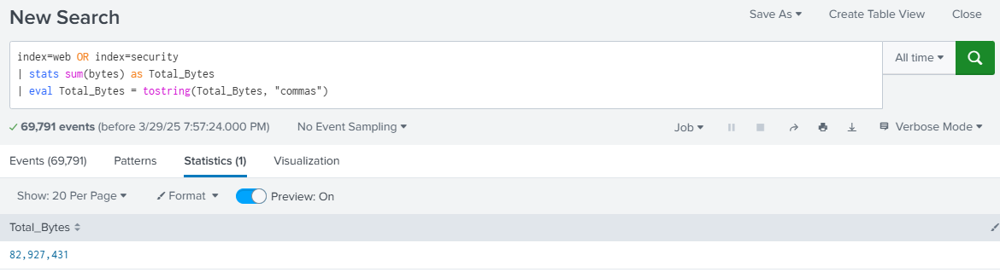
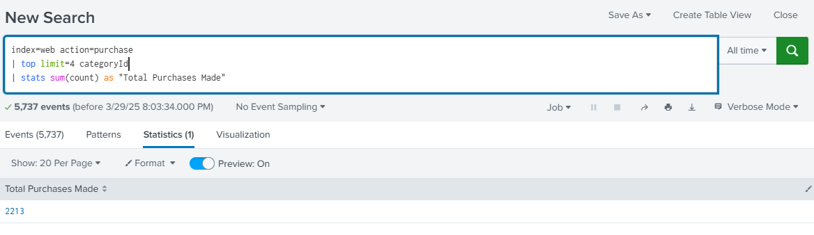
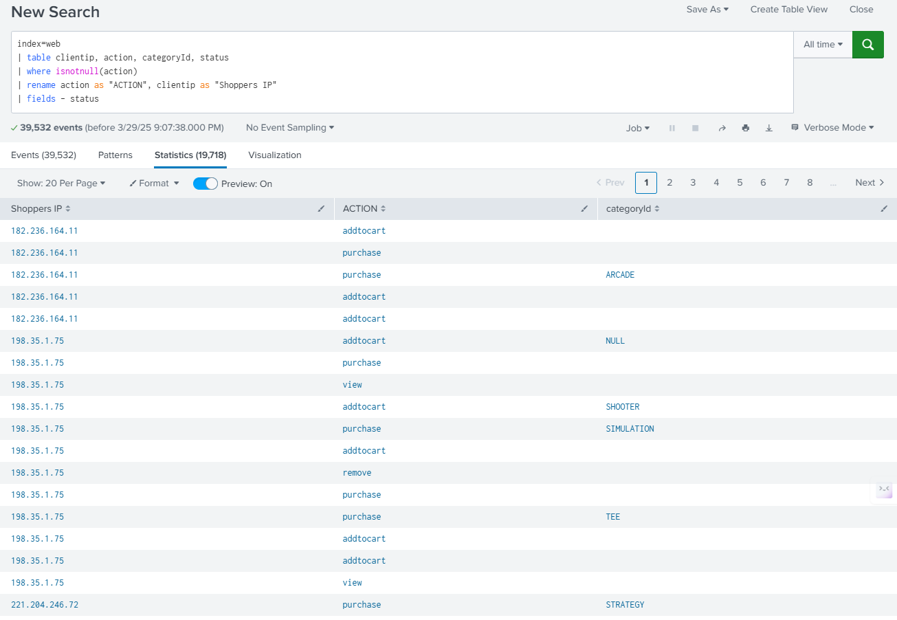

[Table of Contents](https://github.com/drajaram614/SPLUNK/blob/main/README.md)


# Understanding SPLs and Commands in Splunk

## Basic Search & Formatting
- Use **Search & Reporting** to query Splunk data.
- Example: Get total bytes across indexes and format results for readability.
- **Eval + tostring()** helps format large numbers with commas.
- **Keyboard shortcuts:**
  - `Shift + Enter` → Create a new line.
  - `Ctrl + \` → Auto-format search.
  - `Ctrl + Z` → Undo previous entries.
  - `Ctrl + Shift + E` → Expand search (useful for macros).

```spl
index=web OR index=security 
| stats sum(bytes) as Total_Bytes
| eval Total_Bytes = tostring(Total_Bytes, "commas")
```



## SPL Editor Preferences
- Navigate to **Account Preferences > SPL Editor** to customize:
  - **Search assistance:** Enable/disable auto-suggestions.
  - **Line numbers:** Useful for debugging long searches.
  - **Auto-format:** New line added after `|` pipe (recommended).
  - **Themes:** Light, dark, or no theme.

## Working with Arguments
- **Green words** in SPL indicate arguments.
- Example: Find top values for `categoryId`:
  ```spl
  index=web action=purchase | top categoryId limit=6
  ```
- Modify argument (`limit=4`) to adjust displayed results.
- Combine with **stats** to get total purchases per category:

```spl
  index=web action=purchase
| top limit=4 categoryId
| stats sum(count) as "Total Purchases Made"
```


## Essential SPL Commands
### 1. `table`
- Select and order specific fields.
- Example:

```spl
index=web 
| table clientip, action, categoryId, status
| where isnotnull(action)
```

### 2. `rename`
- Rename fields for better readability.
- Example:
  ```spl
  index=web 
  | rename clientip as "Shoppers IP", action as "Action Taken"
  ```

### 3. `fields`
- Include/exclude fields in results.
- Example (exclude `status` field):
  ```spl
  index=web 
  | fields -status
  ```
- Difference between `table` and `fields`:
  - `table` structures output.
  - `fields` filters included/excluded fields.

### 4. `dedup`
- Remove duplicate values in a field.
- Example:
  ```spl
  index=web 
  | dedup clientip
  ```
- Alternative: Use `stats count by clientip`.

### 5. `sort`
- Sort results in ascending/descending order.
- Example:
  ```spl
  index=web 
  | sort -clientip
  ```
- Can also manually sort by clicking on column headers.

