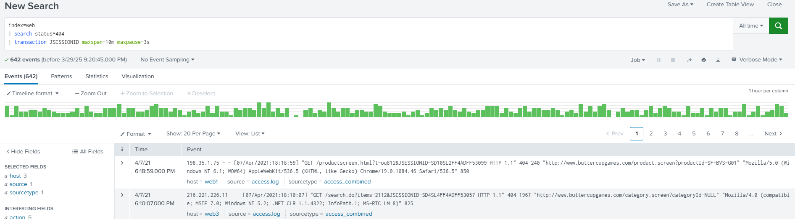
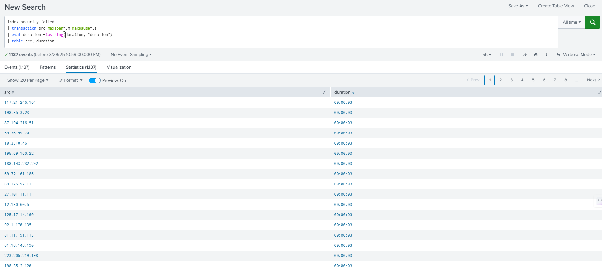
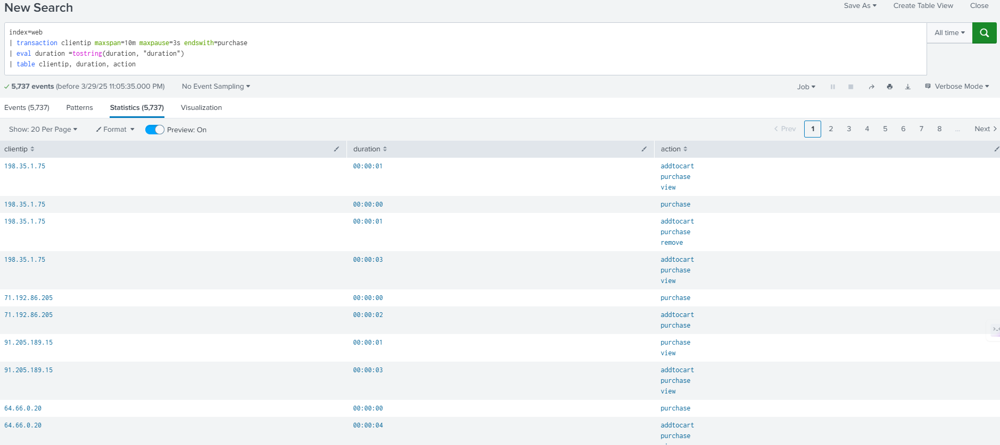

[Table of Contents](https://github.com/drajaram614/SPLUNK/blob/main/README.md)

# Understanding Transaction Commands in Splunk

- **Basic Usage**  
  - Start with `index=web` and apply the `transaction` command.  
  - Transaction groups related events into a single event.  

- **Setting Conversation Length**  
  - Example: Total length of each event = 3 seconds.  
  - Define max conversation length, e.g., `maxspan=10m`.  

- **Identifying Common Fields**  
  - Look for shared fields (e.g., `JSESSIONID`).  
  - Filter results by session ID to track user activity.  

- **Analyzing User Actions**  
  - Example: Add to cart, check product IDs.  
  - Identify irrelevant fields (e.g., product ID mapping).  

- **Investigating HTTP Status Codes**  
  - Focus on `404` errors (page not found).  
  - Check for missing `categoryID` causing issues.  

```spl
index=web
| search status=404
| transaction JSESSIONID maxspan=10m maxpause=3s
```



## **Security Log Analysis (`index=security`)**  
- Investigate failed SSH login attempts by grouping related events into transactions.  
- The `transaction` command consolidates events with the same `src` (source IP) if they occur within a `maxspan` of 3 minutes and a `maxpause` of 3 seconds.  
- The `eval` function converts the transaction duration into a readable format.  
- Sorting by `duration` helps identify prolonged attack attempts or brute-force login attempts.  

```spl
index=security failed
| transaction src maxspan=3m maxpause=3s
| eval duration = tostring(duration, "duration")
| table src, duration
```
  

## **Evaluating Conversation Durations**  
- Track how long different security or user activities last.  
- The `transaction` command groups related events and calculates duration automatically.  
- The `table` command organizes data to display the source IP (`src`) and event duration.  
- Sorting the results by duration can reveal persistent attack patterns or lengthy user sessions.  

## **Applying Transaction to Web Data (`index=web`)**  
- Modify queries for web-related logs, using `clientip` (client IP) instead of `src`.  
- Define transactions with `maxspan=10m` (max session duration) and `maxpause=3s` (time gap allowed between events).  
- Use `endswith=purchase` to track user sessions that result in a purchase.  
- The `eval` function converts the session duration into a human-readable format.  
- Sorting by `duration` helps identify user engagement trends, such as fast shoppers vs. indecisive ones.  

```spl
index=web
| transaction clientip maxspan=10m maxpause=3s endswith=purchase
| eval duration = tostring(duration, "duration")
| table clientip, duration, action
```

 

## **Final Thoughts**  
- The `transaction` command is powerful for analyzing event sequences.  
- It enables tracking of user activities, security threats, and operational anomalies.  
- Useful for investigating web interactions, login attempts, and failed transactions.  
- Helps in threat hunting by revealing patterns in failed login attempts or suspicious activities.  